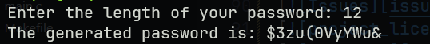

<!-- Improved compatibility of back to top link: See: https://github.com/othneildrew/Best-README-Template/pull/73 -->
<a id="readme-top"></a>
<!--
*** Thanks for checking out the Best-README-Template. If you have a suggestion
*** that would make this better, please fork the repo and create a pull request
*** or simply open an issue with the tag "enhancement".
*** Don't forget to give the project a star!
*** Thanks again! Now go create something AMAZING! :D
-->


<!-- PROJECT SHIELDS -->
<!--
*** I'm using markdown "reference style" links for readability.
*** Reference links are enclosed in brackets [ ] instead of parentheses ( ).
*** See the bottom of this document for the declaration of the reference variables
*** for contributors-url, forks-url, etc. This is an optional, concise syntax you may use.
*** https://www.markdownguide.org/basic-syntax/#reference-style-links
-->
[![Contributors][contributors-shield]][contributors-url]
[![Forks][forks-shield]][forks-url]
[![Stargazers][stars-shield]][stars-url]
[![Issues][issues-shield]][issues-url]
[![MIT License][license-shield]][license-url]
[![LinkedIn][linkedin-shield]][linkedin-url]


<!-- PROJECT LOGO -->
<br />
<div align="center">
  <a href="https://github.com/wuqin04/RandomPasswordGenerator">
    
  </a>

<h3 align="center">RandomPasswordGenerator</h3>

  <p align="center">
    A simple password generator written in **C**.  
    <br />
    <a href="https://github.com/wuqin04/RandomPasswordGenerator"><strong>Explore the docs »</strong></a>
    <br />
    <br />
    <a href="https://github.com/wuqin04/RandomPasswordGenerator">View Demo</a>
    &middot;
    <a href="https://github.com/wuqin04/RandomPasswordGenerator/issues/new?labels=bug&template=bug-report---.md">Report Bug</a>
    &middot;
    <a href="https://github.com/wuqin04/RandomPasswordGenerator/issues/new?labels=enhancement&template=feature-request---.md">Request Feature</a>
  </p>
</div>


<!-- TABLE OF CONTENTS -->
<details>
  <summary>Table of Contents</summary>
  <ol>
    <li>
      <a href="#about-the-project">About The Project</a>
      <ul>
        <li><a href="#built-with">Built With</a></li>
      </ul>
    </li>
    <li>
      <a href="#getting-started">Getting Started</a>
      <ul>
        <li><a href="#prerequisites">Prerequisites</a></li>
        <li><a href="#installation">Installation</a></li>
      </ul>
    </li>
    <li><a href="#usage">Usage</a></li>
    <li><a href="#learning-objectives">Learning Objectives</a></li>
    <li><a href="#contributing">Contributing</a></li>
    <li><a href="#license">License</a></li>
    <li><a href="#contact">Contact</a></li>
    <li><a href="#acknowledgments">Acknowledgments</a></li>
  </ol>
</details>


<!-- ABOUT THE PROJECT -->
## About The Project

[![Product Name Screen Shot][product-screenshot]](images/logo.png)

Here's a blank template to get started. To avoid retyping too much info, do a search and replace with your text editor for the following: `wuqin04`, `RandomPasswordGenerator`, `wuqin419@gmail.com_client`, `wuqin419@gmail.com`, `RandomPasswordGenerator`, `This project was built as practice to explore **memory allocation**, **random number generation**, and **basic input validation** in low-level C programming. `, `MIT License`

<p align="right">(<a href="#readme-top">back to top</a>)</p>


### Built With

* [![C][C]][C-url]

<p align="right">(<a href="#readme-top">back to top</a>)</p>


<!-- GETTING STARTED -->
## Getting Started

### Prerequisites

- A **C compiler** (such as `gcc` or `clang`)  
- (Optional) A **Unix-like environment** (Linux, macOS, or Windows with WSL/MinGW)  
- (Optional, Recommended) `make` installed (to use the included Makefile)  

### Installation

1. Clone the repository:
   ```bash
   git clone https://github.com/wuqin04/RandomPasswordGenerator.git
   ```

2. Build the program using Makefile or gcc compiler:
    ```bash 
    make
    ```
    or
    ```bash
    gcc -o main main.c
    ```

3. Run the program:
    ```bash
    ./main
    ```

4. Enter the desired length of the password:
    ```bash
    Enter the length of your password: 12
    The generated password is: t(9L^:z$X}W!
   ```

5. Change git remote url to avoid accidental pushes to base project:
   ```bash
   git remote set-url origin wuqin04/RandomPasswordGenerator
   git remote -v # confirm the changes
   ```

<p align="right">(<a href="#readme-top">back to top</a>)</p>


<!-- USAGE EXAMPLES -->
## Usage


### Features

- Generates a random password of user-defined length  
- Uses ASCII printable characters (`!` to `~`)  
- Validates user input to ensure the length is an integer  
- Handles memory dynamically with `malloc` and `free`  
- Safe string termination (`'\0'`) for proper C strings  

### Notes

This project uses C’s built-in rand(), which is not cryptographically secure.
It’s fine for learning, but don’t use this for real-world password management.

Input is validated to reject non-integer values, but more robust parsing (e.g., fgets + strtol) could be used.

Extremely large input values may cause memory allocation issues.


<p align="right">(<a href="#readme-top">back to top</a>)</p>


<!-- ROADMAP -->

## Learning Objectives

This project was a hands-on way to practice:

Dynamic memory allocation (malloc, free)

Input validation with scanf

String handling in C ('\0' terminator)

Using ASCII ranges to generate characters

Understanding the limitations of rand()

See the [open issues](https://github.com/wuqin04/RandomPasswordGenerator/issues) for a full list of proposed features (and known issues).

<p align="right">(<a href="#readme-top">back to top</a>)</p>


<!-- CONTRIBUTING -->
## Contributing

Contributions are what make the open source community such an amazing place to learn, inspire, and create. Any contributions you make are **greatly appreciated**.

If you have a suggestion that would make this better, please fork the repo and create a pull request. You can also simply open an issue with the tag "enhancement".
Don't forget to give the project a star! Thanks again!

1. Fork the Project
2. Create your Feature Branch (`git checkout -b feature/AmazingFeature`)
3. Commit your Changes (`git commit -m 'Add some AmazingFeature'`)
4. Push to the Branch (`git push origin feature/AmazingFeature`)
5. Open a Pull Request

<p align="right">(<a href="#readme-top">back to top</a>)</p>

### Top contributors:

<a href="https://github.com/wuqin04/RandomPasswordGenerator/graphs/contributors">
  
</a>


<!-- LICENSE -->
## License

Distributed under the MIT License. See `LICENSE.txt` for more information.

<p align="right">(<a href="#readme-top">back to top</a>)</p>


<!-- CONTACT -->
## Contact

Wuqin04: [wuqin419@gmail.com](wuqin419@gmail.com)
Project Link: [https://github.com/wuqin04/RandomPasswordGenerator](https://github.com/wuqin04/RandomPasswordGenerator)

<p align="right">(<a href="#readme-top">back to top</a>)</p>


<!-- MARKDOWN LINKS & IMAGES -->
<!-- https://www.markdownguide.org/basic-syntax/#reference-style-links -->
[contributors-shield]: https://img.shields.io/github/contributors/wuqin04/RandomPasswordGenerator.svg?style=for-the-badge
[contributors-url]: https://github.com/wuqin04/RandomPasswordGenerator/graphs/contributors
[forks-shield]: https://img.shields.io/github/forks/wuqin04/RandomPasswordGenerator.svg?style=for-the-badge
[forks-url]: https://github.com/wuqin04/RandomPasswordGenerator/network/members
[stars-shield]: https://img.shields.io/github/stars/wuqin04/RandomPasswordGenerator.svg?style=for-the-badge
[stars-url]: https://github.com/wuqin04/RandomPasswordGenerator/stargazers
[issues-shield]: https://img.shields.io/github/issues/wuqin04/RandomPasswordGenerator.svg?style=for-the-badge
[issues-url]: https://github.com/wuqin04/RandomPasswordGenerator/issues
[license-shield]: https://img.shields.io/github/license/wuqin04/RandomPasswordGenerator.svg?style=for-the-badge
[license-url]: https://github.com/wuqin04/RandomPasswordGenerator/blob/master/LICENSE.txt
[linkedin-shield]: https://img.shields.io/badge/-LinkedIn-black.svg?style=for-the-badge&logo=linkedin&colorB=555
[C]: https://img.shields.io/badge/C-000000?style=for-the-badge&logo=c&logoColor=white
[C-url]: https://en.cppreference.com/w/c
